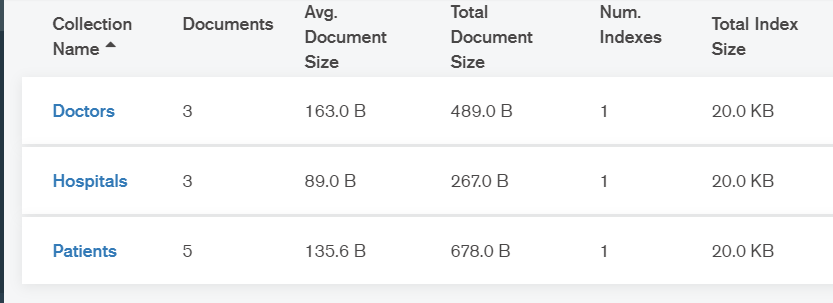
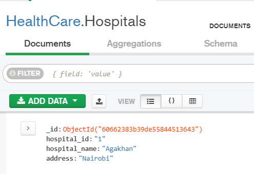
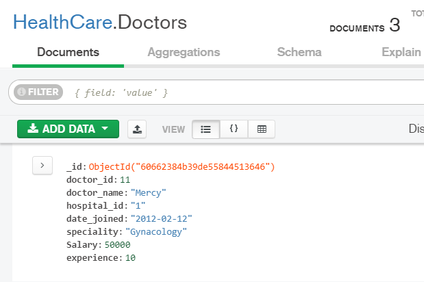
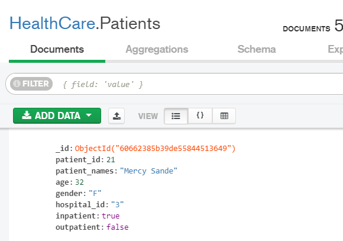
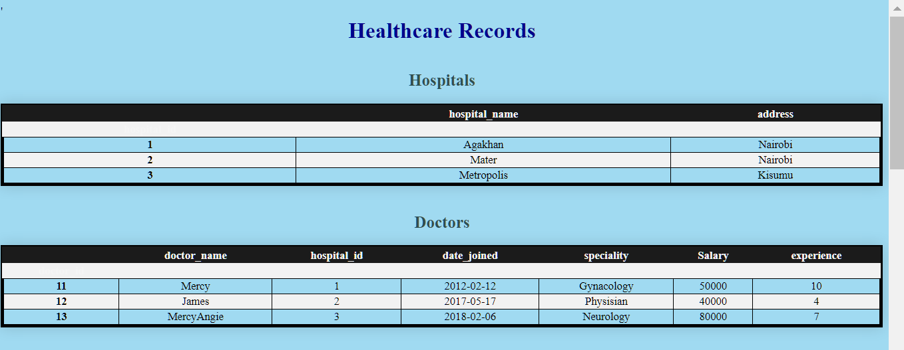
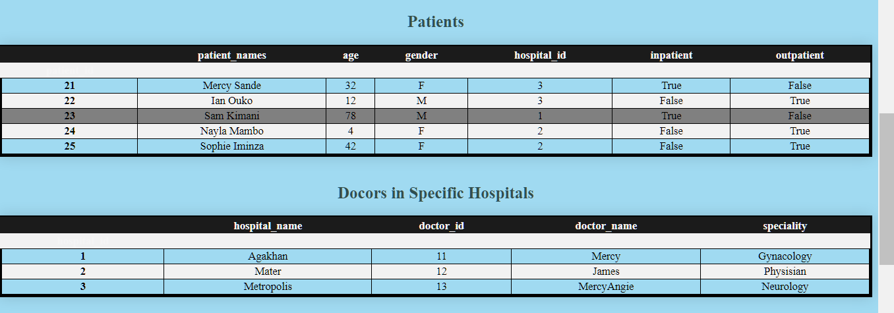
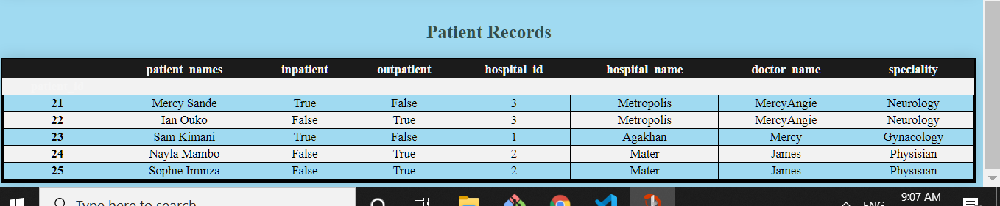

# HealthCare
##  A MongoDB Database created using Python.
The database is hosted in [mongoDB Atlas](https://www.mongodb.com/cloud/atlas) and     
 contains 3 collections (Hospital, Doctor and Patient). The collectins can be viewed locally using **MongoDB Compass** as illustrated:
 
 #### Collections

##### Hospitals Collection

##### Doctors Collection

##### Patients Collection

### health Mongo.ipynb
Jupyter notebook that contains code written in [Python 3.9](https://python.org) HTML and [mongoDB NoSQL](https://www.mongodb.com/)     
Libraries imported are **pymongo**,**pandas**, **dns** and **webbrowser**  
The following is the procedure followed in the code:
- Connect to mongodb atlas server.
- Create the database
- Create the collections
- Join the collections using the *hospital_id* 
- Create dataframes from the collections
- Display dataframes in a webbrowser
#### createcols()
- Inserts documents into the collections from a list of dictionaies.
#### index.html
Webpage displaying all the collections and aggregations
#### On Google Chrome

#### table.css
Contains **CSS** code used to style the tables.

